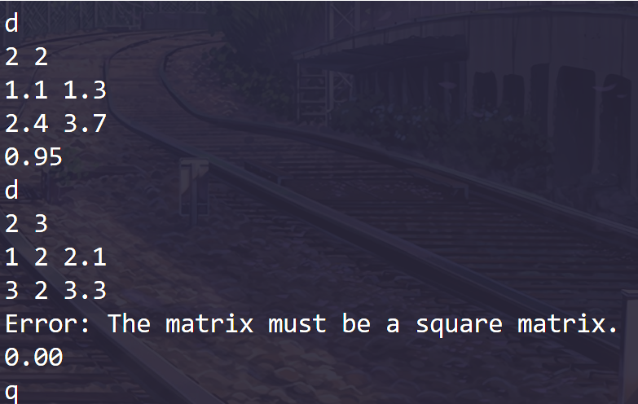
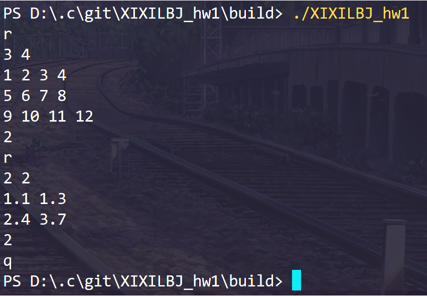

# 作业提交汇总
## 加法
### 实现思路
- 将矩阵对应位置的数字相加即可，注意检验两矩阵是否是同行同列数
### 运行结果

## 减法
### 实现思路
- 与加法类似较为简单
### 运行结果

## 乘法
### 实现思路
- 首先确保第一个矩阵的列数与第二个矩阵的行数相等
- 接着按照矩阵乘法法则把相应项相乘相加即可，技巧是矩阵中的项相乘时第一个矩阵的项的列数与第二个矩阵的项的行数是相同的
### 运行结果

## 数乘
### 实现思路
- 对每一项都乘上那个数即可
### 运行结果

## 转置
### 实现思路
- 把矩阵行列坐标交换即可
### 运行结果

## 行列式计算
### 实现思路
- 首先检验矩阵行数列数是否相等
- 采用递归法计算行列式，构造余子式矩阵，要注意符号
### 运行结果

## 逆矩阵
### 实现思路
- 首先判断是否为奇异矩阵
- 按照公式把伴随矩阵的每一项算出来，行列式前面已经给出，生成余子式只需删除项所在的i行j列
### 运行结果

## 矩阵的秩
### 实现思路
- 高斯消元法求矩阵的秩
### 运行结果

## 矩阵的迹
### 实现思路
- 矩阵行列相同时有，主对角线元素相加即可
### 运行结果
